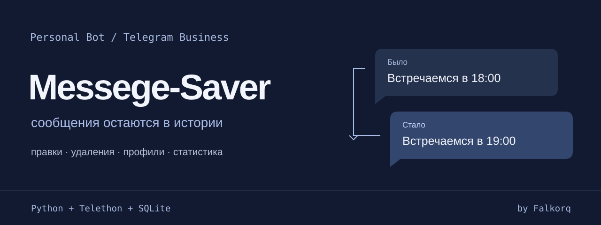
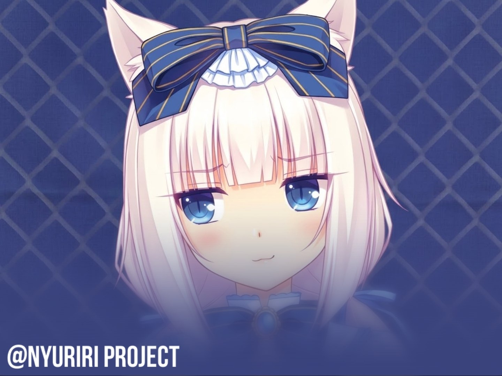

<p align="center">
  <a href="#быстрый-запуск"><strong>Быстрый запуск</strong></a> ·
  <a href="docs/SETUP.md">Настройка сервера</a> ·
  <a href="USER_GUIDE.md">Как пользоваться</a>
</p>

# Messege-Saver

**Personal Bot для Telegram Business:** сохраняет сообщения, показывает историю правок и уведомляет об удалениях. Дополнительно следит за изменениями профилей, собирает статистику чатов и позволяет управлять всем через личный чат с ботом.

## Что умеет

| Возможность | Как работает |
| --- | --- |
| Правки и удаления | Показывает прежний и новый текст, автора, чат, подключённый аккаунт и время сообщения |
| Наблюдение за профилями | Отслеживает имя, username, bio и аватарку; сохраняет историю изменений |
| Статистика | Сводка чатов, медиа и наиболее частых слов |
| Мут | Удаляет новые входящие сообщения выбранного пользователя на заданный срок |
| Доступ для друзей | Приглашения по Telegram ID с отдельными списками наблюдения и настройками |
| Надёжная доставка | Очередь уведомлений, повтор временных ошибок и ручной повтор после устранения постоянной ошибки |

Бот работает с сообщениями из разрешённых ему Business-чатов. **Восстановить сообщение, которое он не получил и не сохранил, нельзя.** Telegram не сообщает, кто именно удалил сообщение: в уведомлении указан его исходный автор.

## Быстрый запуск

Нужны **Python 3.10+**, токен бота и аккаунт с возможностью подключения Telegram Business / Chat Automation.

```sh
git clone https://github.com/Falkorq/Messege-Saver.git
cd Messege-Saver
python -m venv .venv
```

Активируй окружение:

```powershell
# Windows PowerShell
.\.venv\Scripts\Activate.ps1
Copy-Item .env.example .env
```

```sh
# Linux / macOS
source .venv/bin/activate
cp .env.example .env
```

1. Создай бота через BotFather и укажи его токен в `BOT_TOKEN`.
2. Заполни `MY_ACCOUNT_IDS` — ID своих аккаунтов через запятую — и `MY_CHAT_ID`, куда присылать уведомления. Узнать свой ID можно через `/start` у бота после его запуска.
3. Установи зависимости и запусти приложение:

   ```sh
   python -m pip install -r requirements.txt
   python app.py
   ```

4. Отправь боту `/start`, затем подключи его в настройках Telegram Business / Chat Automation к нужным чатам. Открой `/menu` для управления.

`python bot.py` также поддерживается как совместимая команда запуска. SQLite-база создаётся автоматически.

> Наблюдение за профилями требует отдельной пользовательской MTProto-сессии. Создание сессии, второй получатель уведомлений и запуск на Pterodactyl описаны в [полной инструкции](docs/SETUP.md).

## Основные команды

| Команда | Назначение |
| --- | --- |
| `/menu` | Открыть интерфейс Personal Bot |
| `/status` | Подключения, фильтр, очередь и размер базы |
| `/watch @username` | Добавить профиль в наблюдение |
| `/watchlist` | Показать список наблюдения |
| `/chatstats` | Статистика Business-чатов |
| `/mute @username 30m` | Мут на 30 минут |
| `/only_others on` | Не сохранять новые собственные сообщения для уведомлений о правках и удалениях |
| `/retry_failed` | Повторить уведомления после устранения ошибки отправки |

Владелец управляет приглашениями через `/grant`, `/access` и `/revoke`. Все команды и примеры — в [руководстве пользователя](USER_GUIDE.md).

## Интерфейс

Управление находится в личном чате с ботом: inline-меню, карточки профилей, история аватарок и статистика. Баннер меню уже включён в репозиторий; его путь настраивается через `UI_BANNER_PATH`.

<details>
<summary>Посмотреть баннер Personal Bot</summary>



</details>

## Стек и устройство

**Python · pyTelegramBotAPI · Telethon · SQLite**

| Путь | Назначение |
| --- | --- |
| `app.py` | Приложение и обработка Business-сообщений |
| `access_control.py` | Доступ владельцев и приглашённых пользователей |
| `business_notifications.py` | Подписи авторов и чатов в уведомлениях |
| `profile_monitor/` | Мониторинг профилей через Telethon |
| `business_tools/` | Мут, статистика и инструменты чатов |
| `create_telegram_session.py` | Создание пользовательской Telegram-сессии |
| `tests/` | Проверки модулей и интерфейса |

Запустить тесты в окружении с установленными зависимостями:

```sh
python -m unittest discover -s tests
```

## Хранение данных

Сообщения и настройки хранятся в SQLite. Срок хранения сообщений задаётся `RETENTION_DAYS`, по умолчанию — 90 дней. Владелец сервера имеет технический доступ к сохранённым данным.

`.env`, база, локальные аватарки и рабочие архивы исключены из Git. Не публикуй токен бота и `TELEGRAM_SESSION`: пользовательская сессия даёт доступ к Telegram-аккаунту.

---

Проект [Falkorq](https://github.com/Falkorq). [Настройка сервера](docs/SETUP.md) · [Руководство пользователя](USER_GUIDE.md)
